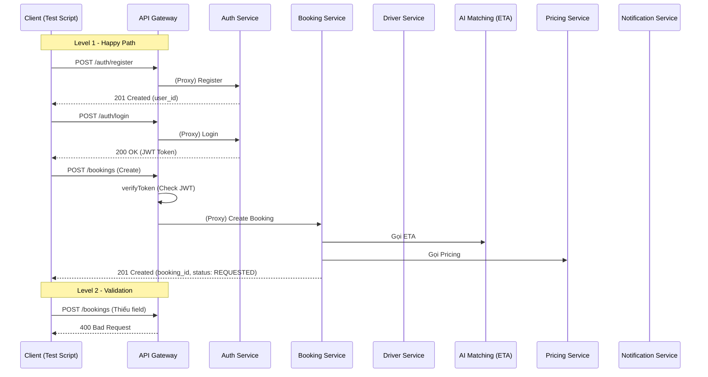

# Giải thích chi tiết Level 1 & Level 2 - Hệ thống CabGo

Chào bạn! Dưới đây là giải thích chi tiết về luồng hoạt động (Call Flow) và ý nghĩa của các bài test trong 2 Level đầu tiên của đồ án CabGo.

## 1. Luồng gọi (Call Flow) tổng quan

Hệ thống được thiết kế theo kiến trúc Microservices, giao tiếp qua API Gateway.



---

## 2. Chi tiết Level 1 - Happy Path (Luồng cơ bản)

Mục tiêu: Đảm bảo các chức năng lõi hoạt động đúng khi input hợp lệ.

| STT | Test Case | Giải thích luồng gọi | Nếu PASS (Thành công) | Nếu FAIL (Thất bại) |
|:---:|:---|:---|:---|:---|
| 1 | **Đăng ký User** | Client -> Gateway -> Auth Service (Lưu DB) | Trả về `201 Created`, có `user_id`. | Trả về `400` hoặc `500`. DB không lưu được user. |
| 2 | **Đăng nhập (JWT)** | Client -> Gateway -> Auth Service (Verify pass) | Trả về `200 OK` kèm Token. Token chứa `sub` (user_id) và `exp`. | Sai password/email -> `401 Unauthorized`. |
| 3 | **Driver Online** | Client -> Gateway -> Driver Service (Update status) | DB Driver cập nhật trạng thái `ONLINE`. | Driver không tồn tại hoặc lỗi DB -> `404/500`. |
| 4 | **Tạo Booking** | Client -> Gateway -> Booking Service -> (ETA + Pricing) | Trả về `201`, trạng thái `REQUESTED`. Có `booking_id`. | Hệ thống AI hoặc Pricing chết -> Trả về lỗi hoặc status `FAILED`. |
| 5 | **List Bookings** | Client -> Gateway -> Booking Service (Query DB) | Trả về mảng các booking của user đó. | Token hết hạn hoặc sai user_id -> `401`. |
| 6 | **Gọi API ETA** | Client -> Gateway -> AI Matching Service | Trả về số phút di chuyển dự kiến > 0. | Input sai tọa độ -> `400` hoặc crash service. |
| 7 | **Pricing API** | Client -> Gateway -> Pricing Service | Trả về giá tiền (VND). | Tính toán chia cho 0 hoặc lỗi logic -> `500`. |
| 8 | **Notification** | Client -> Gateway -> Notification Service | Trả về `200`. Noti được đưa vào hàng đợi (Kafka/Redis). | Service chết -> Không gửi được thông báo. |
| 9 | **Logout** | Client -> Gateway -> Auth Service (Blacklist token) | Trả về `200`. Token cũ không dùng được nữa. | Token không bị khóa -> Lỗ hổng bảo mật. |

---

## 3. Chi tiết Level 2 - Validation & Edge Cases (Xử lý lỗi)

Mục tiêu: Hệ thống phải "Fail an toàn", không crash và trả đúng mã lỗi khi input sai.

| STT | Test Case | Kịch bản thử nghiệm | Mong đợi (PASS) | Rủi ro nếu FAIL |
|:---:|:---|:---|:---|:---|
| 11 | **Thiếu Pickup** | Gửi request tạo booking nhưng không có tọa độ đón. | Trả về `400 Bad Request`, thông báo "pickup is required". | Hệ thống cố lưu vào DB -> Lỗi Null Pointer hoặc crash service. |
| 12 | **Sai format Lat/Lng** | Gửi vĩ độ/kinh độ là string "abc" thay vì số. | Trả về `422 Unprocessable Entity` (Lỗi validation). | Service AI tính toán với string -> Crash hệ thống. |
| 13 | **Không có tài xế** | Request ở vùng không có driver nào ONLINE. | Booking status chuyển thành `FAILED` hoặc `PENDING`. Trả msg "No drivers available". | User chờ vô tận hoặc hệ thống bị treo flow matching. |
| 14 | **Payment invalid** | Chọn phương thức thanh toán không tồn tại. | Trả về `400`, báo lỗi phương thức thanh toán. | Tạo booking xong không thanh toán được -> Thất thoát doanh thu. |
| 15 | **ETA Distance = 0** | Điểm đón trùng điểm đến. | ETA trả về `0` hoặc rất nhỏ, hệ thống không crash. | Lỗi logic chia cho khoảng cách (distance=0) -> Crash service. |
| 16 | **Demand Index = 0** | Kiểm tra logic Surge Pricing khi nhu cầu thấp. | Hệ số Surge trả về 1.0 (mặc định), giá không bị âm/zero. | Giá trả về 0 -> Tài xế bị lỗ. |
| 17 | **Fraud API thiếu field** | Gọi API check gian lận nhưng thiếu user_id. | Trả về `400`, yêu cầu đầy đủ field. | Bẻ khóa logic gian lận nếu input không được kiểm soát. |
| 18 | **Token expired** | Dùng Token đã hết hạn để gọi API. | Trả về `401 Unauthorized`. | Hacker dùng token cũ để truy cập dữ liệu user. |
| 19 | **Idempotency** | Gửi 1 request 2 lần (do lag hoặc double click). | Chỉ 1 booking được tạo, 2 request trả về cùng 1 kết quả. | User bị trừ tiền 2 lần, tạo 2 chuyến xe trùng nhau. |
| 20 | **Payload quá lớn** | Gửi dữ liệu rác > 1MB. | Gateway chặn ngay lập tức, trả về `413 Payload Too Large`. | Bị tấn công DOS làm tràn bộ nhớ (RAM) của service. |

---

## 4. Cách chạy TEST trong đồ án

Để kiểm tra hệ thống, bạn chạy các lệnh sau tại thư mục gốc:

1. **Khởi động hệ thống:**
   ```powershell
   docker-compose up -d
   ```

2. **Chạy Test Level 1 (Cơ bản):**
   ```powershell
   node tests/verify_lv1.js
   ```

3. **Chạy Test Level 2 (Nâng cao/Validation):**
   ```powershell
   node tests/verify_lv2.js
   ```

> [!TIP]
> Bạn nên chạy **Level 1 trước** để đảm bảo core logic chạy thông, sau đó mới chạy Level 2 để kiểm tra khả năng chịu lỗi của hệ thống.
